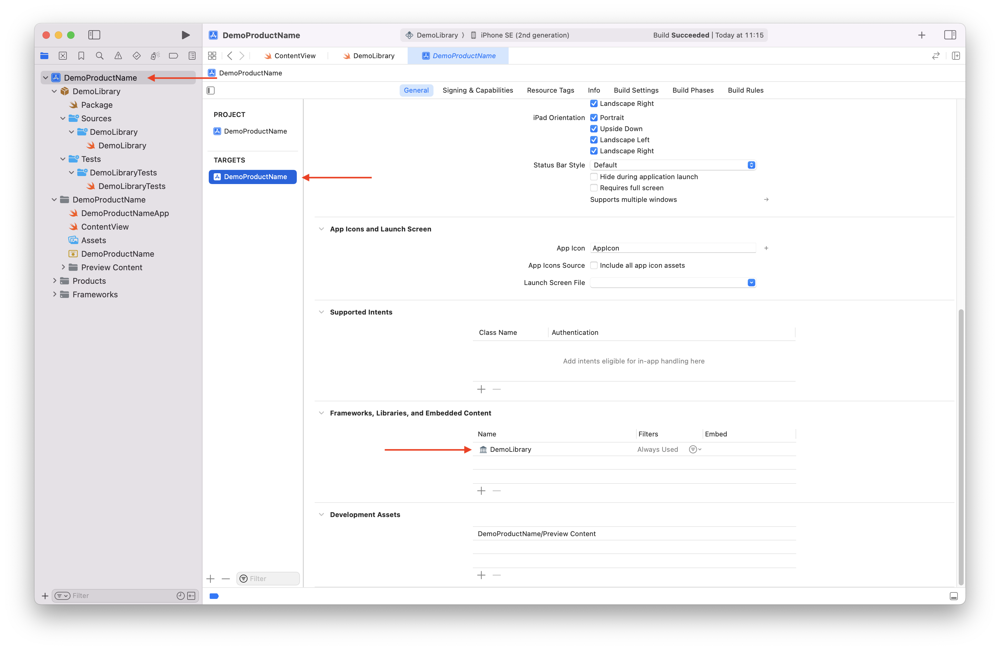

_Written for Xcode 15.2_

## Create the multiplatform app

Start Xcode and go to `File`➡️`New Project` (⇧⌘N)

Select the `Multiplatform` `App` template and click `Next`:


Set the options for the new project and click `Next`.
We'll be using `DemoProductName` to see how Xcode uses this name. For example, note how it's automatically appended to the organization identifier, generating the bundle identifier:


Save the project on the disk.

At this point, Xcode has created a `DemoProductName` scheme which can build the app for iOS or MacOS.

## Create a package

Go to `File`➡️`New Package` (^⇧⌘N) and select the `Multiplatform` `Library` template:


Click `Next` and select the previously-created top-level folder (`DemoProductName` in our example). The `Add to:` and `Group:` dropdowns can also be set to the top-level `DemoProductName`.

We'll be using `DemoLibrary` for the package name:


This will create a new scheme (`DemoLibrary`) as well as a `Package.swift` file, defining one **product** and two **targets**:

```swift
// swift-tools-version: 5.9
// The swift-tools-version declares the minimum version of Swift required to build this package.

import PackageDescription

let package = Package(
    name: "DemoLibrary",
    products: [
        // Products define the executables and libraries a package produces, making them visible to other packages.
        .library(
            name: "DemoLibrary",
            targets: ["DemoLibrary"]),
    ],
    targets: [
        // Targets are the basic building blocks of a package, defining a module or a test suite.
        // Targets can depend on other targets in this package and products from dependencies.
        .target(
            name: "DemoLibrary"),
        .testTarget(
            name: "DemoLibraryTests",
            dependencies: ["DemoLibrary"]),
    ]
)
```

To try out  the library, add a simple struct in `DemoLibrary.swift`:

```swift
public struct DemoStruct {
    public init() {}

    public func demoFunc(_ input: Int) -> String {
        input.description
    }
}
```

This can be tested by updating the test target - in our case edit `DemoLibraryTests.swift`:

```swift
import XCTest
@testable import DemoLibrary

final class DemoLibraryTests: XCTestCase {
    func testDemoFunc() throws {
        let sut = DemoStruct()
        XCTAssertEqual(sut.demoFunc(42), "42")
    }
}
```

The tests can run by selecting the `DemoLibrary` scheme and then `Product`➡️`Test` (⌘U).

## Embed the library to the app target

To access `DemoStruct` from the iOS app, select the project and then the iOS target:



After adding `DemoLibrary` under `Frameworks, Libraries and Embedded Content`, it should be possible to import it and access its public interface:

```swift
// DemoProductNameApp.swift

import DemoLibrary
import SwiftUI

@main
struct DemoProductNameApp: App {
    let demoStruct = DemoStruct()

    var body: some Scene {
        WindowGroup {
            ContentView()
                .onAppear {
                    print(demoStruct.demoFunc(42))
                }
        }
    }
}
```

## Notes

* When adding a new `Target` in a package's `targets` array, a folder with a matching name should be created under `Sources`:


* A target's name is used if another target needs it as a dependency:
```swift
.target(
    name: "targetA",
    dependencies: []
),
.target(
    name: "targetB",
    dependencies: [
        "targetA",
    ]
),
```
